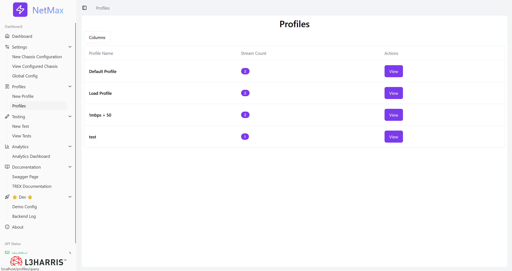

# NetMax

### L3Harris + University of Utah

#### Written by Dax McPartland, Gavin Kerr, Jack Severson, Ryan Taffe

##### May 1st, 2025

---

## Table of Contents

1. [Getting Started](#getting-started)

   - [Overview of NetMax](#overview-of-netmax)
   - [Installation & Setup](#installation--setup)
   - [Using the API from the Terminal](#using-the-api-from-the-terminal)

2. [Creating a Chassis](#creating-a-chassis)

   - [Chassis Creation from the UI](#chassis-creation-from-the-ui)

3. [Creating a Testing Profile](#creating-a-testing-profile)

   - [Profile Creation from the UI](#profile-creation-from-the-ui)

4. [Performing Tests](#performing-tests)

   - [Running Tests from the UI](#running-tests-from-the-ui)

5. [Analytics](#analytics)

   - [Accessing Analytics from the UI](#accessing-analytics-from-the-ui)

6. [Global Configuration Settings](#global-configuration-settings)

    - [TRex Settings](#trex-settings)
    - [Scheduling Settings](#scheduling-settings)

---

## Getting Started

### Overview of NetMax

NetMax is a capstone project for the University of Utah (2024-2025). The project was sponsored and developed for L3Harris. NetMax is an application that allows engineers at L3Harris to network test hardware. The application utilizes [TRex](https://trex-tgn.cisco.com/trex/doc/index.html) to define and run network traffic.

### Installation & Setup

To start running NetMax, first check the .env.example file for environment variables to set. Alternatively, rename the .env.example file to be '.env'. Then navigate to the `docker-compose.yml` file in the current directory. Then, in the terminal, run:

```sh
docker compose build
```

This may take some time as it creates the necessary containers for running the app. Once the build process is complete, run:

```sh
docker compose up
```

This will start the containers. To verify that the project is running, open any web browser and navigate to:

```
http://localhost/
```

This will bring you to the dashboard of the app. The remainder of this documentation explains how to perform various actions using both the frontend UI and the API via terminal commands.

---

## Using the API from the Terminal

NetMax provides a RESTful API that can be accessed using `curl`. This allows you to create and manage chassis, testing profiles, and run tests from the command line. You can also reference the [Swagger API documentation](http://localhost/swagger/index.html) for more details.

### Example

To create a chassis from the terminal, send a `POST` request:

```sh
curl --header "Content-Type: application/json" \
     --request POST \
     --data '{"name": "chassisName", "description": "chassisDescription", "hostname": "192.168.1.1", "syncPort": 4501, "asyncPort": 4500}' \
     http://localhost/api/Chassis
```

--- 

## Creating a Chassis

The first step in running a network test is defining the hardware to be tested.

### Chassis Creation from the UI

To create a chassis from the frontend, navigate to **New Chassis Configuration** under the **Settings** tab in the navigation sidebar.


Here, you will define the chassis information. Click **Add Chassis** to verify its correctness. NetMax will not allow the creation of a hardware chassis if it is not online.

After creating a chassis, you can view all configured chassis under the **View Configured Chassis** page in the **Settings** tab.


This will display all previously created chassis. Clicking **View** on one will show its hardware capabilities and allow modifications or deletion. **Note:** If TRex is not running, you will not be able to view chassis capabilities.

---

## Creating a Testing Profile

To define the type of network test to be performed, a new testing profile must be created.

### Profile Creation from the UI

To create a profile, navigate to **New Profile** under the **Profiles** tab in the sidebar. Here, you can define how you want to test by adding new data streams and specifying the test parameters.


To view previously created profiles, go to the **Profiles** page under the **Profiles** tab.

This page displays all existing profiles and allows you to **edit** or **delete** them by clicking the **View** button.




---

## Performing Tests  

### Running Tests from the UI  

To execute a test using the UI, navigate to **New Test** in the **Tests** tab, select your chassis. This will reveal available ports for that chassis. Select which ports you would like to run the test on. For each port a dropdown menu will become available. Select the profile you want for each port. Then click **Next**.  


From here, you can either run the test immediately or schedule it for a later date and time.  

To view all tests, click on the **View Tests** button under the **Tests** tab. This page displays all tests along with their statuses, which can be: **Completed, Running, Failed, Disrupted, Scheduled,** or **Killed**.  


You can also manage tests from this page. If you need to stop or rerun a test, simply click on the **View** action next to it.  

---

## Analytics  

To analyze test performance, navigate to the **Analytics Dashboard** under the **Analytics** tab. This page provides insights into completed tests, including packet loss, latency, and throughput.  

### Accessing Analytics from the UI

This pages allows you to customize your charts to track different metrics for your tests. Clicking on the **New Chart** button will add a chart to your view where you have the ability to customize the time frame, metrics, and ports that the traffic was running on.


---

## Global Configuration Settings  

The global configuration file is accessible under the **Settings** tab. Here, you can configure TRex and scheduling settings.  

- **TRex Settings**:  
  - Enforce test stop times: If a test is scheduled for 10 seconds, you can configure whether it should be forcefully stopped at exactly 10 seconds. Note that in TRex, high-speed tests might take additional time to process all data, even after reaching the scheduled time limit.  

- **Scheduling Settings**:  
  - Define the maximum duration for a scheduled test.  
  - Set limits on how far in advance a test can be scheduled.  

These settings help manage test execution and ensure consistency across scheduled tests.  

---


